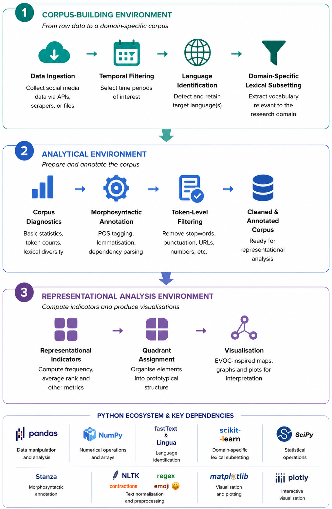
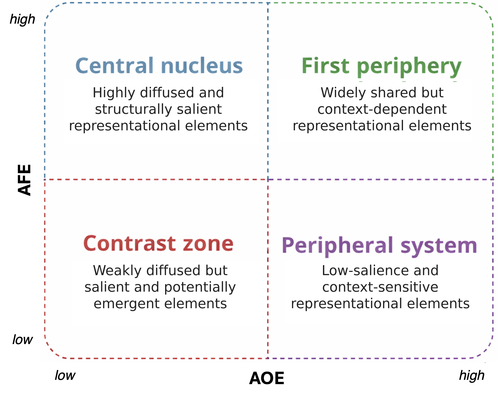
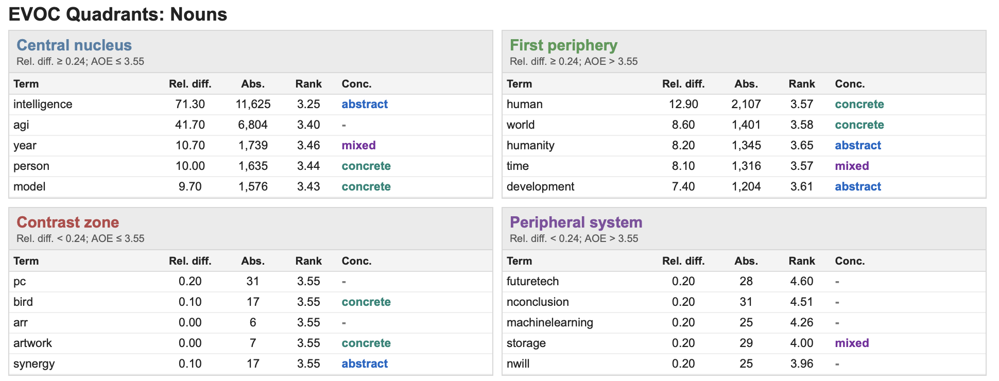
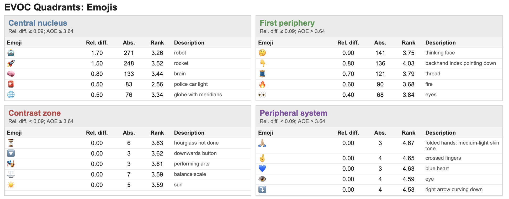
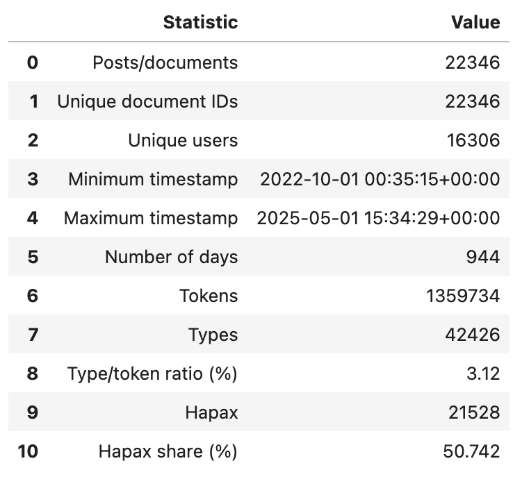
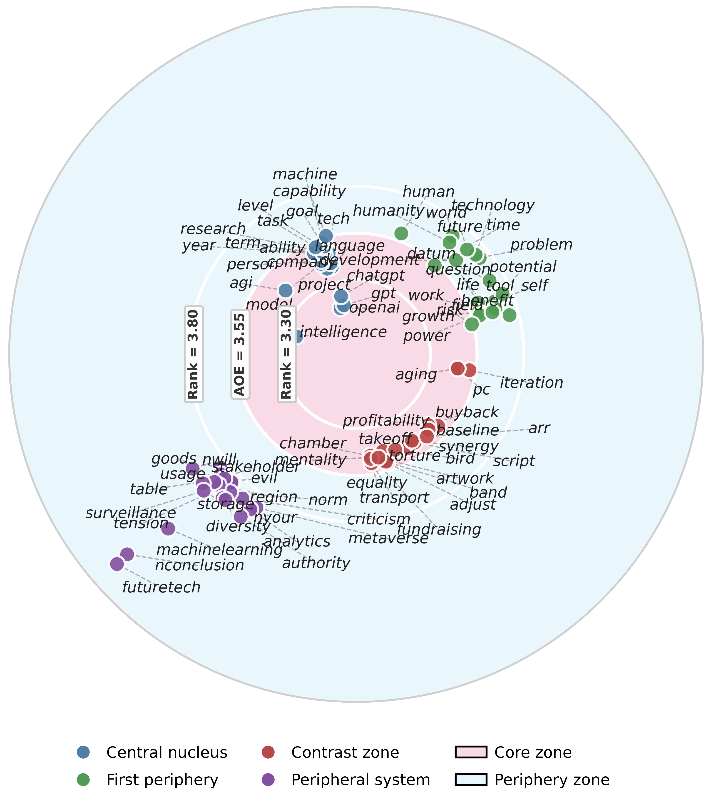
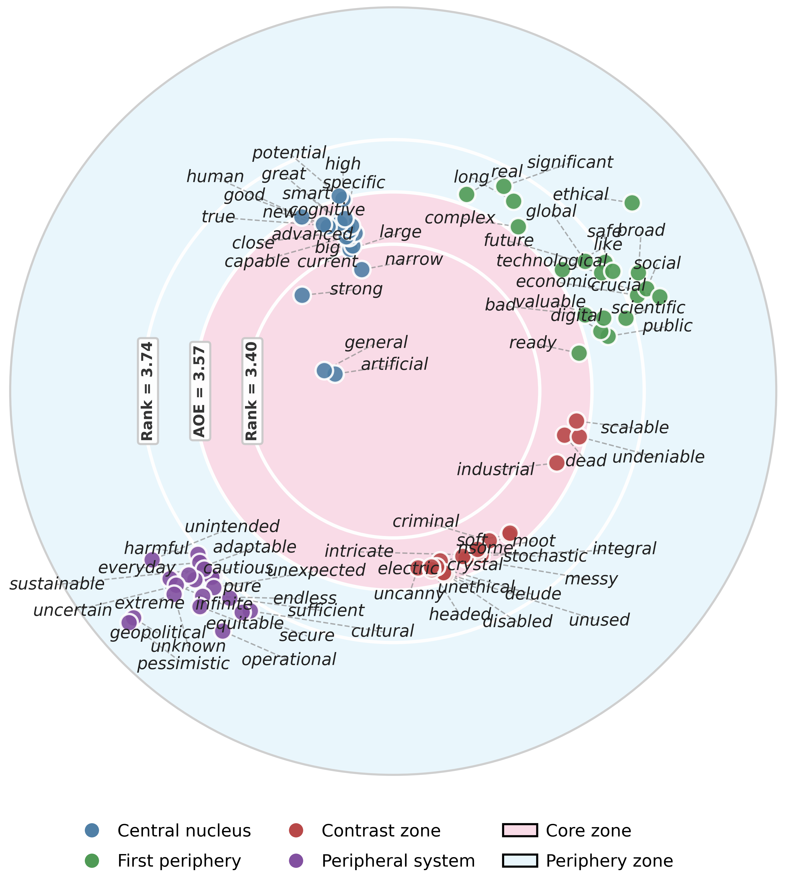
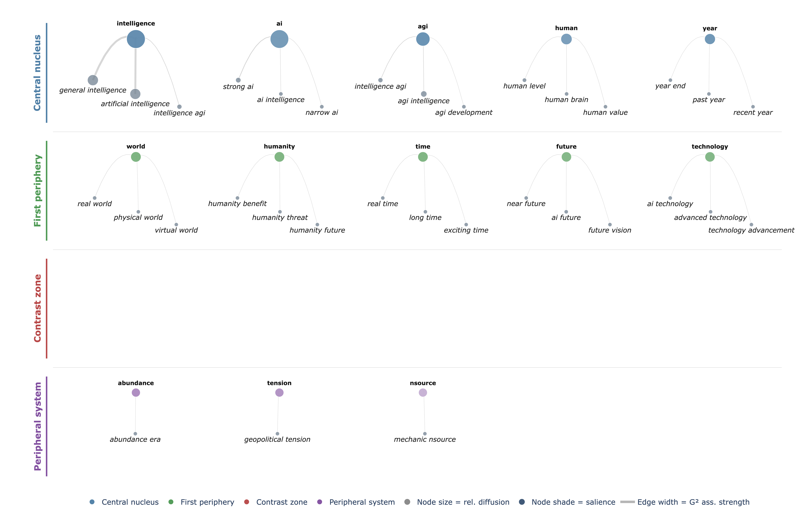
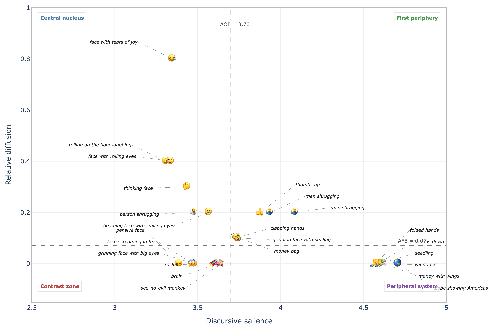
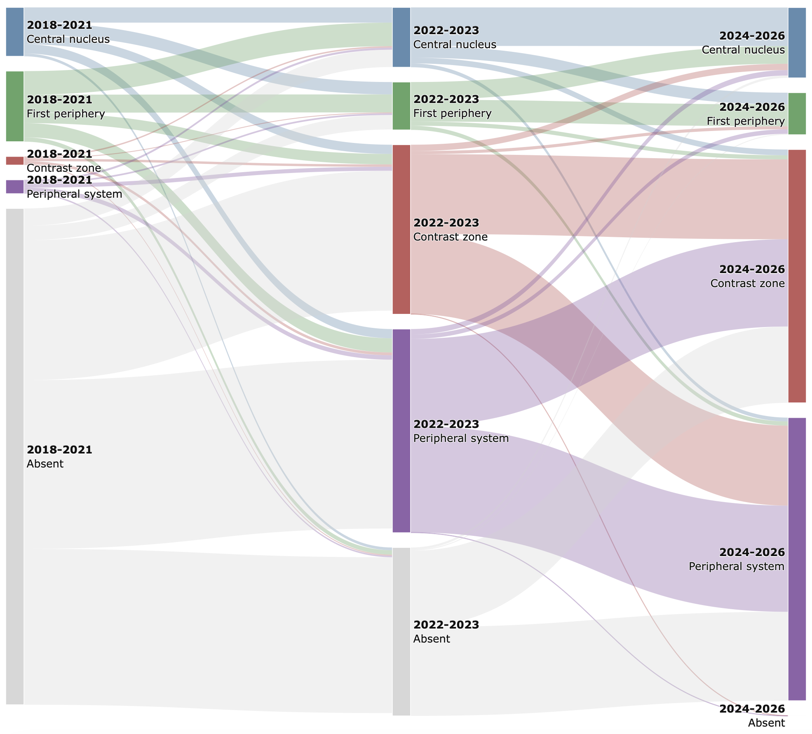

<p align="center">
  
</p>

<p align="center">
  <strong>A Python Framework for Hierarchical Evocation Analysis in Large-Scale Digital Corpora</strong>
</p>

<p align="center">
  <a href="https://opensource.org/licenses/MIT"></a>
  <a href="docs/methodology.md"></a>
  <a href="https://doi.org/10.5281/zenodo.20493285"></a>
</p>

---

## Overview

**PyEvoc** is an open-source Python framework that operationalises the **Hierarchical Evocation Method (HEM)** for large-scale digital communication environments.

The framework extends classical approaches developed within **Social Representation Theory (SRT)** by reconstructing representational structures directly from naturally occurring online discourse — without relying on elicitation tasks. It combines lexical diffusion, positional salience, rhetorical foregrounding, semantic association, and temporal dynamics to identify the central and peripheral elements of public representations.

PyEvoc provides a complete, end-to-end workflow: from corpus ingestion and linguistic annotation, through EVOC quadrant assignment and collocation analysis, to temporal stability assessment and interactive visualisation.

> A detailed mathematical description of the framework is available in [docs/methodology.md](docs/methodology.md).

---

## Installation

To install the package:

```bash
pip install git+https://github.com/text-lab/pyevoc.git
```

---

## Features

| Module | Capabilities |
|---|---|
| **Corpus Construction** | Flexible CSV ingestion, date filtering, metadata preservation, schema mapping |
| **Language Processing** | fastText+Lingua language identification, Stanza annotation, lemmatisation, POS tagging, dependency parsing |
| **Thematic Extraction** | Anchor-based filtering, semantic expansion, domain-specific subcorpus generation |
| **Representational Analysis** | AFE/AOE reconstruction, EVOC quadrant assignment, central nucleus and peripheral structure plot |
| **Semantic Analysis** | Collocations, named entities, entity–term overlap, semantic trees |
| **Longitudinal Analysis** | Temporal structures, quadrant transitions, stability indices, Sankey evolution diagram |
| **Reporting** | Interactive HTML outputs, publication-ready figures |

---

## Expected Input Structure

PyEvoc requires a `pandas.DataFrame` with at least four columns:

| Column | Description |
|---|---|
| `user_id` | User identifier |
| `document_id` | Document identifier |
| `time` | Datetime variable |
| `text` | Raw textual content |

Additional metadata columns are automatically preserved throughout the pipeline.

---

## Computational Pipeline

<p align="center">
  
</p>

The pipeline consists of 15 stages: dataset ingestion → language identification → thematic filtering → corpus diagnostics → linguistic annotation → emoji processing → structural foregrounding → term-level indicators → concreteness labelling → EVOC quadrant assignment → collocation extraction → named entity recognition → temporal stability analysis → interactive reporting → visual analytics.

---

## EVOC Quadrant Structure

<p align="center">
  
</p>

Lexical units are positioned in a two-dimensional space defined by **representational diffusion** (AFE) and **discursive salience** (AOE), yielding four analytically distinct zones:

| Zone | Diffusion | Salience | Interpretation |
|---|---|---|---|
| **Central Nucleus** | High | High | Stable, consensual core of the representation |
| **First Periphery** | High | Low | Widely shared but contextually flexible elements |
| **Contrast Zone** | Low | High | Minority positions or emerging framings |
| **Peripheral System** | Low | Low | Contextually variable, weakly structured elements |

Thresholds are computed separately for each POS category (nouns, adjectives, emojis) to avoid artefacts from grammatical frequency asymmetries.

---

## Example Outputs

The examples presented in this repository use the **AGI dataset** introduced by Xie and He (2025). The dataset originally contains **53,649 social media posts** related to Artificial General Intelligence (AGI).
The dataset is publicly available at: <a href="https://github.com/BIMSA-DATA/FGPO/blob/main/AGI.xlsx">https://github.com/BIMSA-DATA/FGPO/blob/main/AGI.xlsx</a>

If you use this dataset in your research, please cite:

> Xie, H., & He, M. (2025). *Tracking Fine-Grained Public Opinions: Two Datasets from Online Discourse on Trending Topics*. Mathematics, 13(21), 3433. doi: <a href="https://doi.org/10.3390/math13213433">10.3390/math13213433</a>

> [!IMPORTANT]
> The AGI dataset is **not distributed as part of PyEvoc** and remains the intellectual property of its original authors. It is used in this repository solely as an illustrative example to demonstrate the software's analytical capabilities. Users are responsible for complying with the dataset's terms of use and citation requirements.

<table>
  <tr>
    <td align="center"><strong>EVOC Quadrants — Nouns</strong><br></td>
  </tr>
  <tr>
    <td align="center"><strong>EVOC Quadrants — Nouns</strong><br></td>
  </tr>
  <tr>
    <td align="center"><strong>EVOC Quadrants - Emojis</strong><br></td>
  </tr>
</table>

<p align="center">
  
</p>

<table>
  <tr>
    <td align="center"><strong>EVOC Target — Nouns</strong><br></td>
    <td align="center"><strong>EVOC Target — Adjectives</strong><br></td>
  </tr>
  <tr>
    <td align="center"><strong>EVOC Semantic Tree — Nouns</strong><br></td>
    <td align="center"><strong>EVOC Semantic Tree — Adjectives</strong><br></td>
  </tr>
  <tr>
    <td align="center"><strong>EVOC Emoji Map</strong><br></td>
    <td align="center"><strong>EVOC Temporal Stability (Sankey)</strong><br></td>
  </tr>
</table>

---

## Package Structure

```text
PyEvoc/
├── pyevoc/           # Core library
├── assets/           # Logo, figures
├── docs/             # methodology.md and additional documentation
├── examples/         # Worked examples
├── tests/            # Test suite
├── README.md
├── LICENSE
├── CITATION.cff
└── pyproject.toml
```

### Bundled Models

All required resources are distributed locally and loaded automatically:

```text
models/
├── lid.176.bin         # fastText language identification model
├── emoji_lookup.csv    # Emoji–description mapping
├── concreteness.csv    # Concreteness norms
└── ...
```

---

## Reproducibility

PyEvoc is designed to support transparent and reproducible computational social science research. The framework preserves metadata throughout the workflow, records processing parameters, exports intermediate outputs, and generates human-readable HTML reports alongside publication-ready figures.

---

## Citation

If you use PyEvoc in academic work, please cite:

```bibtex
@software{misuraca2026pyevoc,
  author       = {Misuraca, Michelangelo},
  title        = {PyEvoc: Computational Hierarchical Evocation Analysis for Digital Corpora},
  year         = {2026},
  version      = {0.1.0},
  publisher    = {Zenodo},
  doi          = {10.5281/zenodo.20493284},
  url          = {https://doi.org/10.5281/zenodo.20493284}
}
```

---

## License

This project is licensed under the [MIT License](LICENSE).
