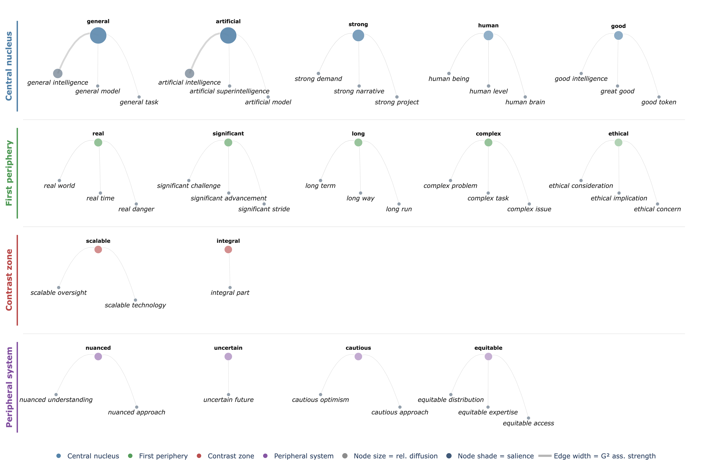
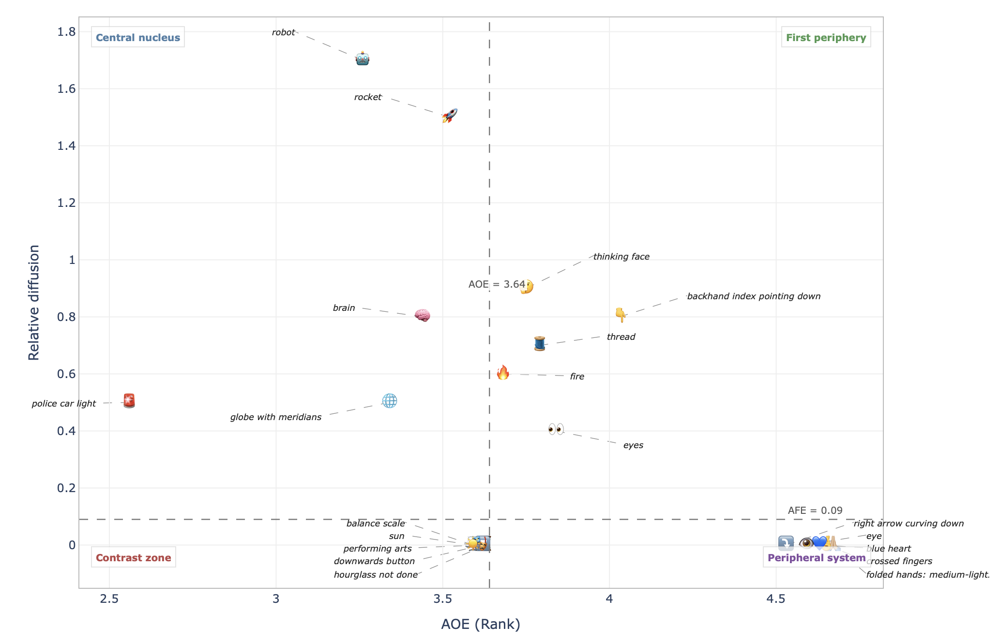
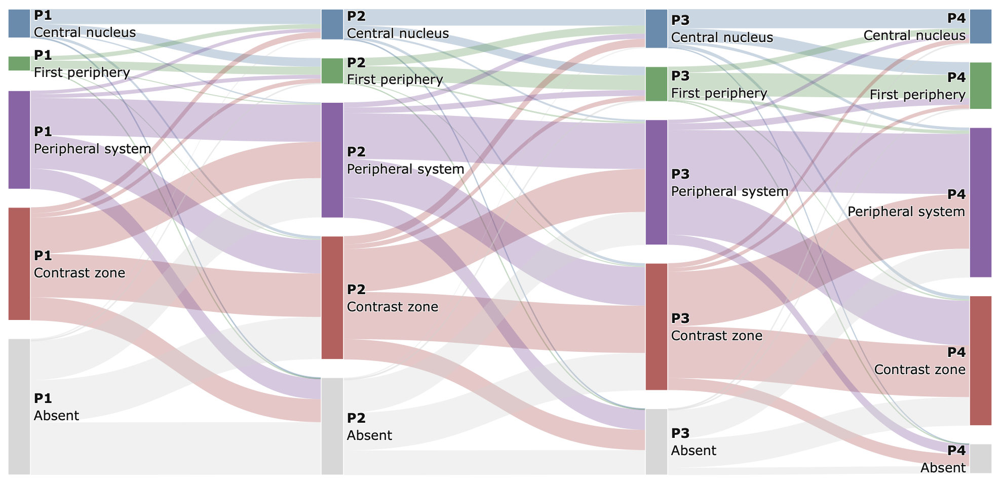

# PyEvoc Documentation

PyEvoc is a Python package for corpus-based representational analysis grounded in the EVOC (Étude des VOCabulaire) framework. It processes social-media or text corpora through a modular pipeline that ends in visual outputs showing how words and emojis are distributed across conceptual zones.

---

## Table of Contents

1. [Installation](#installation)
2. [Pipeline Overview](#pipeline-overview)
3. [Step-by-Step Guide](#step-by-step-guide)
   - [Step 1 – Import PyEvoc](#step-1--import-pyevoc)
   - [Step 2 – Load and standardise the dataset](#step-2--load-and-standardise-the-dataset)
   - [Step 3 – Language filtering](#step-3--language-filtering)
   - [Step 4 – Thematic filtering](#step-4--thematic-filtering)
   - [Step 5 – Corpus statistics](#step-5--corpus-statistics)
   - [Step 6 – Text cleaning](#step-6--text-cleaning)
   - [Step 7 – Linguistic annotation](#step-7--linguistic-annotation)
   - [Step 8 – Emoji assignment](#step-8--emoji-assignment)
   - [Step 9 – Structural foregrounding and positional salience](#step-9--structural-foregrounding-and-positional-salience)
   - [Step 10 – Unigram selection](#step-10--unigram-selection)
   - [Step 11 – Compute AFE/AOE indices](#step-11--compute-afeaoe-indices)
   - [Step 12 – Concreteness labelling](#step-12--concreteness-labelling)
   - [Step 13 – Emoji labelling](#step-13--emoji-labelling)
   - [Step 14 – EVOC quadrants](#step-14--evoc-quadrants)
   - [Step 15 – Collocations and Named Entities](#step-15--collocations-and-named-entities)
   - [Step 16 – Temporal stability](#step-16--temporal-stability)
   - [Step 17 – Visualisations](#step-17--visualisations)
4. [Output Reference](#output-reference)

---

## Installation

**From source (recommended for development):**

```bash
git clone https://github.com/text-lab/pyevoc.git
cd pyevoc
pip install -e .
```

The `-e` flag installs in editable mode so any local changes are immediately available.

**Directly from GitHub:**

```bash
pip install git+https://github.com/text-lab/pyevoc.git
```

**Optional dependencies:**

```bash
pip install lingua-language-detector   # for secondary language validation
```

Stanza language models (required for annotation):

```python
import stanza
stanza.download("en")
```

---

## Pipeline Overview

The pipeline follows this module structure:

```
pyevoc.data            → load and standardise the corpus
pyevoc.preprocessing   → language filtering, thematic filtering,
                         cleaning, annotation
pyevoc.features        → salience, term indices, emoji & concreteness labels
pyevoc.analysis        → EVOC quadrants, collocations, temporal stability
pyevoc.visualisation   → maps, trees, Sankey diagrams
```

Each step produces an output dataframe that is passed to the next step. Intermediate results can be saved and reloaded, which is useful for long annotation runs.

---

## Step-by-Step Guide

### Step 1 – Import PyEvoc

Verify the package is importable and confirm which installation is being used:

```python
import os
import pandas as pd
import pyevoc

print("PyEvoc imported from:")
print(pyevoc.__file__)
```

> **Tip:** Keep your dataset file, your anchor list, and your notebook in the same folder to simplify path management.

---

### Step 2 – Load and standardise the dataset

PyEvoc expects four columns with specific names:

| Standard name | Description |
|---|---|
| `user_id` | Author or account identifier |
| `doc_id` | Document or post identifier |
| `time` | Publication timestamp |
| `text` | Raw text content |

Map your own column names to these standards via `DatasetConfig`. Any extra columns in your source file are preserved.

**Example – mapping from a Twitter dataset:**

```python
from pyevoc.data.dataset import DatasetConfig, load_dataset

INPUT_FILE = "AGI.xlsx"   # .csv, .tsv, .xlsx, .parquet, or .json

config = DatasetConfig(
    column_map={
        "account_ID":      "user_id",
        "tweet_ID":        "doc_id",
        "tweet_pub_time":  "time",
        "tweet_text":      "text",
    },
    start_date="2022-10-01",
    end_date="2025-05-01",
    timezone="UTC",
    drop_missing_text=True,
)

corpus = load_dataset(INPUT_FILE, config=config)
print(corpus.shape)
```

---

### Step 3 – Language filtering

PyEvoc uses a two-stage language identification workflow. The primary detector is **fastText** (`lid.176.bin`); an optional secondary validator uses **Lingua** for uncertain cases.

Supported languages: English, Italian, French, German, Spanish, Portuguese.

**Download the fastText model (first time only):**

```python
from pyevoc.preprocessing.language_filtering import download_fasttext_lid_model
model_path = download_fasttext_lid_model(compact=False)
```

**Apply filtering:**

```python
from pyevoc.preprocessing.language_filtering import (
    LanguageFilterConfig,
    filter_by_language,
)

lang_config = LanguageFilterConfig(
    text_col="text",
    target_language="en",
    min_probability=0.90,           # fastText confidence threshold
    ambiguous_min_probability=0.50, # lower bound for Lingua fallback
    ambiguous_max_probability=0.90, # upper bound for Lingua fallback
    use_lingua_fallback=True,
    lingua_min_confidence=0.80,
    keep_probability=True,
    keep_diagnostics=False,
    verbose=False,
)

subcorpus_lin = filter_by_language(corpus, config=lang_config, model_path=model_path)
print(subcorpus_lin.shape)
```

> **Note:** Large corpora can take several minutes. Enable `verbose=True` to see progress.

---

### Step 4 – Thematic filtering

This step extracts a domain-specific subcorpus using an anchor term list. The anchor file is a plain `.txt` file with one term or phrase per line.

```python
from pyevoc.preprocessing.thematic_filtering import (
    ThematicFilterConfig,
    build_thematic_subset,
)

ANCHOR_FILE = "anchor.txt"

theme_config = ThematicFilterConfig(
    text_col="text",
    min_anchor_hits=1,
    similarity_threshold=0.10,
    min_expansion_hits=2,
    max_features=50000,
    lowercase=True,
    ngram_range=(1, 2),
)

subcorpus_the, theme_metadata = build_thematic_subset(
    subcorpus_lin,
    anchor_file=ANCHOR_FILE,
    config=theme_config,
)
print(subcorpus_the.shape)
```

> **Tip:** This step is optional. If your entire corpus is already domain-specific, you can skip it and pass `subcorpus_lin` directly to the next step.

---

### Step 5 – Corpus statistics

Get a descriptive summary of the filtered corpus before proceeding:

```python
from pyevoc.preprocessing.corpus_statistics import corpus_statistics

stats = corpus_statistics(
    subcorpus_lin,   # or subcorpus_the if thematic filtering was applied
    text_col="text",
)
stats
```

---

### Step 6 – Text cleaning

Cleaning produces a new column `clean_text` in the dataframe:

```python
from pyevoc.preprocessing.cleaning import CleaningConfig, clean_corpus

clean_config = CleaningConfig(
    lowercase=True,
    remove_urls=True,
    url_placeholder="URL",
    expand_contractions=True,
    space_emojis=True,
    reduce_elongated_vowels=True,
    space_punctuation=True,
    show_progress=True,
)

corpus_clean = clean_corpus(
    subcorpus_lin,   # or subcorpus_the
    text_col="text",
    output_col="clean_text",
    config=clean_config,
)
```

---

### Step 7 – Linguistic annotation

Annotation uses **Stanza** to produce a token-level dataframe with columns for token, lemma, UPOS tag, dependency relations, and positional metadata.

> **Prerequisite:** Download the Stanza English model once: `stanza.download("en")`

```python
from pyevoc.preprocessing import (
    AnnotationConfig,
    annotate_with_stanza,
)

ann_config = AnnotationConfig(
    text_col="clean_text",
    doc_id_col="doc_id",
    user_col="user_id",
    time_col="time",
    language="en",
    processors="tokenize,pos,lemma,depparse",
    use_gpu=True,
    batch_size=128,
    save_parquet=True,
    output_dir="annotated_outputs",
    output_name="corpus_stanza_anno",
)

tokens_raw = annotate_with_stanza(corpus_clean, config=ann_config)
```

**Recovering from a saved annotation** (avoids re-running annotation):

```python
import pandas as pd, os

tokens_raw = pd.read_parquet(
    os.path.join("annotated_outputs", "corpus_stanza_anno.parquet")
)
```

---

### Step 8 – Emoji assignment

Emoji tokens are identified and reassigned to the `EMOJI` UPOS category so they can be treated as a distinct lexical class in subsequent steps:

```python
from pyevoc.features.emoji_assignment import assign_emoji_upos

tokens, emoji_diag, emoji_top = assign_emoji_upos(
    tokens_raw,
    token_col="token",
    upos_col="upos",
    lemma_col="lemma",
    return_diagnostics=True,
)
```

---

### Step 9 – Structural foregrounding and positional salience

This step computes the indicators that reconstruct the AOE-like salience component: opening-sentence position, emphasis, list/quote context, and intensification. Weights must sum to 1.0.

```python
from pyevoc.features.foregrounding import (
    ForegroundingConfig,
    ForegroundingWeights,
    add_salience_indicators,
    foregrounding_diagnostics,
    metadata_coverage,
)

metadata_coverage(tokens)

fg_config = ForegroundingConfig(
    doc_col="doc_id",
    user_col="user_id",
    time_col="time",
    token_col="token",
    sentence_col="sentence_id",
    position_col="position",
    weights=ForegroundingWeights(
        opening_sentence=0.35,
        emphasis=0.25,
        list_or_quote=0.20,
        intensification=0.20,
    ),
)

tokens = add_salience_indicators(tokens, config=fg_config)
foregrounding_diagnostics(tokens)
```

---

### Step 10 – Unigram selection

This step filters the token table down to the lexical units used for representational analysis. The minimum document and user thresholds control how rare a term must be to be excluded.

```python
from pyevoc.features.unigram_selection import select_unigrams

tokens_selected, unigram_diag, unigram_params = select_unigrams(
    tokens,
    keep_upos={"NOUN", "ADJ", "EMOJI"},
    token_col="token",
    lemma_col="lemma",
    upos_col="upos",
    doc_col="doc_id",
    user_col="user_id",
    min_docs_per_term=3,
    min_users_per_term=3,
    return_diagnostics=True,
)

unigram_diag
```

---

### Step 11 – Compute AFE/AOE indices

This step produces the core quantitative indices: diffusion (AFE), rank-weighted salience (AOE), and positional salience. A quadrant summary is returned alongside the per-term table.

```python
from pyevoc.features.term_indices import SalienceConfig, compute_term_statistics

term_stats, pos_thresholds, quadrant_summary = compute_term_statistics(
    tokens_selected,
    term_col="term",
    upos_col="upos",
    user_col="user_id",
    doc_col="doc_id",
    time_col="time",
    r_pos_col="r_pos",
    r_str_col="r_str",
    config=SalienceConfig(
        alpha=0.50,
        max_rank_value=5.0,
        use_users_for_frequency=True,
        focal_upos={"NOUN", "ADJ", "EMOJI"},
    ),
)

pos_thresholds
```

---

### Step 12 – Concreteness labelling

When a concreteness lexicon is available, this step adds concreteness labels to `term_stats`:

```python
from pyevoc.features.concreteness import load_concreteness_lexicon, add_concreteness_labels

lexicon = load_concreteness_lexicon()

term_stats, concreteness_coverage = add_concreteness_labels(
    term_stats,
    lexicon=lexicon,
)

concreteness_coverage
```

---

### Step 13 – Emoji labelling

Adds human-readable descriptions to emoji terms. When a dedicated lookup entry is unavailable, the function falls back to standard Unicode names:

```python
from pyevoc.features.emoji_labelling import load_emoji_lookup, add_emoji_descriptions

emoji_lookup = load_emoji_lookup()

term_stats, emoji_coverage, emoji_methods, missing_emoji = add_emoji_descriptions(
    term_stats,
    lookup=emoji_lookup,
    min_similarity=0.80,
)

emoji_coverage
```

---

### Step 14 – EVOC quadrants

Thresholds are computed **per POS category**. Terms are assigned to one of four quadrants based on their AOE rank and relative diffusion. An HTML report is generated automatically.

```python
from pyevoc.analysis.quadrants import assign_evoc_quadrants

evoc_quadrants, quadrant_counts, pos_thresholds_round = assign_evoc_quadrants(
    term_stats,
    generate_html=True,
    html_output_dir="evoc_outputs",
    html_top_n=5,
)

evoc_quadrants.attrs["html_outputs"]
```

The four EVOC zones and what they mean:

| Zone | AOE rank | Relative diffusion | Interpretation |
|---|---|---|---|
| **Central nucleus** | Low (high salience) | High | Highly shared, strongly foregrounded – the core of the representation |
| **First periphery** | Low (high salience) | High | Shared and accessible, but less central |
| **Contrast zone** | High (low salience) | High | Diffuse but not prototypical – contested or transitional elements |
| **Peripheral system** | High (low salience) | Low | Individual or emerging elements at the margins |

---

### Step 15 – Collocations and Named Entities

Extracts statistically significant bigram collocations and, optionally, named entities from the annotated token table:

```python
from pyevoc.analysis.collocations_entities import extract_collocations_and_entities

colloc_results = extract_collocations_and_entities(
    tokens_df=tokens_raw,
    include_collocations=True,
    include_entities=False,  # set True to include NER
    min_freq=2,
    min_docs=2,
    min_users=2,
    write_html=True,
)

collocations_df = colloc_results["collocations_df"]
print(collocations_df.shape)
```

To include named entities and resolve overlaps with collocations:

```python
results = extract_collocations_and_entities(
    tokens_df=tokens,
    include_collocations=True,
    include_entities=True,
    entity_n=2,
    resolve_overlap=True,
    prefer_overlap="evidence",
    write_html=True,
)

collocations_df  = results["collocations_df"]
entities_df      = results["entities_df"]
overlap_log_df   = results["overlap_log_df"]
```

---

### Step 16 – Temporal stability

Temporal stability analysis re-runs the EVOC framework within each time period so you can track how terms migrate between zones over time.

**Equal-interval partitioning:**

```python
from pyevoc.analysis.temporal_stability import run_temporal_stability_analysis

temporal_results = run_temporal_stability_analysis(
    df=tokens_selected,
    evoc_quadrants_df=evoc_quadrants,
    pos_thresholds_round_df=pos_thresholds_round,
    n_periods=4,
    time_period_mode="equal_days",
    show_tables=False,
)
```

**Custom time boundaries:**

```python
temporal_results = run_temporal_stability_analysis(
    df=tokens_selected,
    evoc_quadrants_df=evoc_quadrants,
    pos_thresholds_round_df=pos_thresholds_round,
    time_period_mode="custom",
    custom_time_cuts=["2022-01-01", "2024-01-01"],
    period_labels=["2018-2021", "2022-2023", "2024-2026"],
    show_tables=False,
)
```

---

### Step 17 – Visualisations

PyEvoc provides four main plot types. Set a shared output directory and call them in sequence:

```python
from pyevoc.visualisation import (
    build_evoc_target_plot,
    build_evoc_collocation_tree_for_upos,
    build_emoji_evoc_plot,
    build_temporal_sankey_ordered,
)

OUTPUT_DIR = "evoc_outputs"
```

#### EVOC target maps

Scatter-like plots that position each term according to its AOE rank (x-axis) and relative diffusion (y-axis), with coloured quadrant regions.

```python
plot_nouns = build_evoc_target_plot(
    evoc_quadrants, "NOUN", pos_thresholds_round,
    output_dir=OUTPUT_DIR, node_size_mode="fixed",
)

plot_adjectives = build_evoc_target_plot(
    evoc_quadrants, "ADJ", pos_thresholds_round,
    output_dir=OUTPUT_DIR, node_size_mode="fixed",
)
```


*Example: EVOC target map for nouns. Each term is placed by its AOE rank (x-axis) and relative diffusion (y-axis). Dashed lines mark the quadrant thresholds.*


*Example: EVOC target map for adjectives.*

#### EVOC semantic trees

Arc diagrams showing each term's top bigram collocates, grouped by quadrant:

```python
tree_nouns = build_evoc_collocation_tree_for_upos(
    evoc_quadrants_df=evoc_quadrants,
    collocations_df=collocations_df,
    tokens_df=tokens_raw,
    upos="NOUN",
    output_dir=OUTPUT_DIR,
    top_roots_per_quadrant=5,
    max_leaves_per_root=3,
    min_leaf_freq=5,
)

tree_adjectives = build_evoc_collocation_tree_for_upos(
    evoc_quadrants_df=evoc_quadrants,
    collocations_df=collocations_df,
    tokens_df=tokens_raw,
    upos="ADJ",
    output_dir=OUTPUT_DIR,
    top_roots_per_quadrant=5,
    max_leaves_per_root=3,
    min_leaf_freq=5,
)
```



*Collocation tree for adjectives. Node size encodes relative diffusion; node shade encodes salience; edge width encodes G² association strength.*

#### EVOC emoji map

Plots emoji terms on the same AOE × diffusion space as the target maps:

```python
fig_emoji, emoji_evoc_df, emoji_evoc_html = build_emoji_evoc_plot(
    html_file=f"{OUTPUT_DIR}/evoc_quadrants_emoji_compact.html",
    output_dir=OUTPUT_DIR,
    output_png=None,
)
```



*Example: EVOC emoji map. Emoji labels are placed by their AOE rank and diffusion score.*

#### EVOC temporal Sankey

Flow diagram that traces how terms move between quadrants across time periods:

```python
sankey_results = build_temporal_sankey_ordered(
    period_quadrants=temporal_results["period_quadrants"],
    output_dir=OUTPUT_DIR,
    output_html="evoc_temporal_sankey.html",
    output_png=None,
    arrangement="snap",
    show_zero_nodes=False,
    width=1000,
    height=500,
)
```



*Example: Sankey diagram across four time periods (P1–P4). Each ribbon traces terms as they remain stable or migrate between zones.*

---

## Output Reference

After completing the full pipeline you will have produced:

| Output | Description |
|---|---|
| `corpus` | Standardised corpus dataframe |
| `subcorpus_lin` | Language-filtered corpus |
| `subcorpus_the` | Thematically filtered subcorpus (if applied) |
| `corpus_clean` | Cleaned corpus with `clean_text` column |
| `tokens_raw` / `tokens_selected` | Token-level annotated dataframes |
| `term_stats` | Per-term AFE/AOE indices with concreteness and emoji labels |
| `evoc_quadrants` | EVOC zone assignments per term |
| `collocations_df` | Bigram collocations with association statistics |
| `temporal_results` | Per-period quadrant assignments and transitions |
| `evoc_outputs/` | HTML reports and static PNG visualisations |

For theoretical background on the EVOC framework and the AFE/AOE indices, see `docs/methodology.md`.
